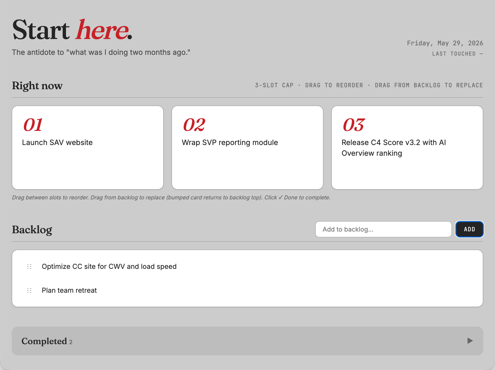

# Start Here

A single HTML file for the moment you come back to work and can't remember what you were doing.

**[Try it now →](https://robriggs3.github.io/start-here/start-here.html)** · No install. No account. Your data stays in your browser.



## What it is

One page, opened first every time you sit down to work.

- Three priorities, hard cap
- Backlog with drag-and-drop
- Completed log so future-you sees that something happened
- Editable sections for your projects, automated routines, agents, rules, and quick links
- Everything stored in your browser via localStorage

## What it is not

- A product
- A SaaS app
- A todo list replacement
- A team tool

It is a personal landing page. Built for one specific failure mode: opening your laptop after weeks away and not remembering what you were working on.

## Install

1. Download `start-here.html`
2. Open it in a browser
3. Bookmark it as your start page
4. Edit the HTML directly if you want to change defaults, sections, or branding

That's the entire install.

## Philosophy

Most productivity apps assume daily use. Real life doesn't work like that. You have a divorce, a busy quarter, a sick kid, and suddenly six weeks have passed.

This page is designed for the moment you come back. Not to track everything. To remember what mattered last time.

Three principles drove the design:

1. **Hard caps over soft preferences.** Three priorities means three. The hard cap forces a decision. Soft caps don't.
2. **Content elements editable, interface elements not.** Your priorities are editable. The "drag to reorder" hint is not. The page should always teach itself.
3. **No data leaves your browser.** No login, no servers, no analytics, no telemetry. Your data is in your browser's localStorage and nowhere else.

## How it works

The whole page is one HTML file with three layers:

- **HTML structure** — the sections and their layout
- **CSS** — design tokens at the top via CSS custom properties, easy to recolor
- **JavaScript** — state in a single object persisted to localStorage, rendered on every change

State shape:

```js
{
  topThree: [item | null, item | null, item | null],
  backlog: [item, ...],
  completed: [item, ...],
  rules: [item, ...],
  returnRitual: [item, ...],
  routines: [item, ...],
  agents: [agent, ...],
  links: [link, ...],
  liveProjects: [project, ...],
  pausedProjects: [project, ...],
  lastSession: string
}
```

Each item has a stable `id` so edits survive drags and reorders without race conditions.

## Branding and colors

The page ships in [Code Conspirators](https://codeconspirators.com) red. Six CSS variables drive everything; change them and the rest follows. Find the `:root` block at the top of `<style>`.

```css
--accent: #c72027;          /* primary accent */
--accent-hover: #9c181d;    /* darker on hover */
--accent-soft: #f3d1d3;     /* subtle accent backgrounds */
--bg: #cccccc;              /* page background */
--bg-card: #ffffff;         /* card background */
--text: #242424;            /* primary text */
```

## Compatibility

**Tested:** modern Chrome, Safari, Firefox on macOS.

**Known limitation:** mobile drag-and-drop does not work reliably. HTML5 drag-and-drop has poor touch support across iOS Safari and Android Chrome. Reading and tapping work; reordering priorities or backlog items on a phone does not work consistently.

Use mobile as read mode. Edit from a laptop or desktop.

If mobile drag matters for your use, swap the native drag handlers for [SortableJS](https://sortablejs.github.io/Sortable/) and submit a PR.

## Customizing

Edit `start-here.html` directly. Notable spots near the top of the `<script>` tag:

- `DEFAULT_RULES`, `DEFAULT_RETURN_RITUAL`, `DEFAULT_ROUTINES`, `DEFAULT_AGENTS`, `DEFAULT_LINKS`, `DEFAULT_LIVE_PROJECTS`, `DEFAULT_PAUSED_PROJECTS` — change the seed content shown on first load and after a reset.

- Section visibility — if you don't want a section (e.g. no "Agents" because you don't use AI), delete the corresponding `<section>` block in the HTML and its render function. Each section is independent.

- Adding a new editable section — copy the pattern from any existing editable list. Each follows the same structure: default constant → render function → blur handler with ID-based stale protection → add input + reset button.

## Status

**Early release.** Maintained as time allows. Stable for personal use; not feature-complete by design.

- **Bug reports:** open an issue. Include browser, OS, steps to reproduce.
- **PRs:** bug fixes welcome. Feature PRs likely declined; the goal is to stay small.
- **Feature requests:** open an issue, but expect "no" as a likely answer. The page does what it does on purpose.
- **General questions:** the Discussions tab, or reach out via my [LinkedIn](https://linkedin.com/in/robriggs).

This is not a product. It is a template I shipped because it was useful to me.

## License

MIT. Take it, fork it, rebrand it, sell a recolored version — the license permits all of it. Credit is appreciated but not required.

## Credit

Built by [Rob Riggs](https://robriggs.com) at [Code Conspirators](https://codeconspirators.com).
